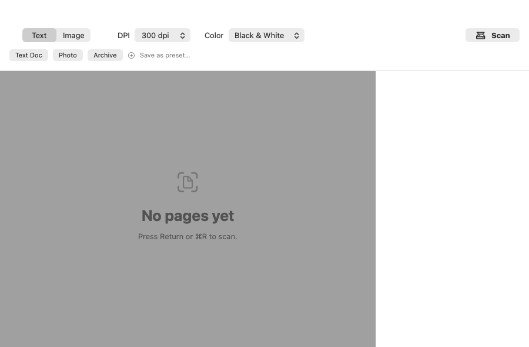

# Scanners

A native macOS (arm64) document/image scanning app for the HP ScanJet 4570c and other
SANE `hp5590`-backend scanners. Scan to searchable PDF or image. No Homebrew, no
drivers to install — SANE ships bundled inside the app.

[](https://github.com/jac18281828/scanners/actions/workflows/ci.yml)
[](https://github.com/jac18281828/scanners/actions/workflows/release.yml)



## Install

1. Download the latest `Scanners-<version>-arm64.zip` from
   [Releases](https://github.com/jac18281828/scanners/releases).
2. Unzip it and drag `Scanners.app` to `/Applications`.
3. **First launch only** — this build is signed ad-hoc, not with an Apple Developer ID
   (see [Signing](#signing) below), so Gatekeeper will refuse a plain double-click the
   first time with an "unidentified developer" warning. Clear it once, either way:
   - **Right-click (or Control-click) `Scanners.app` → Open → Open** in the dialog that
     appears. macOS remembers this app is trusted from then on — plain double-click
     works for every launch after.
   - Or, from Terminal, drop the quarantine flag directly:
     ```
     xattr -dr com.apple.quarantine /Applications/Scanners.app
     ```
4. Plug in the scanner, launch Scanners, and scan.

No Homebrew, no SANE install, no driver package — `Scanners.app` carries its own
`libsane`/`libusb`.

## Supported hardware

- **Validated**: HP ScanJet 4570c (USB), flatbed, via the SANE `hp5590` backend.
- **Likely to work** (same `hp5590` backend family, not individually tested): HP
  ScanJet 4500C, 5500C, 5550C, 5590, 7650.
- Any scanner connected via USB and enumerable by SANE's `hp5590` backend should work.
  Other SANE backends are not bundled — see
  [#1](https://github.com/jac18281828/scanners/issues/1) for what's involved in adding
  one (it's more than a config flag; scope and risks documented there).

## Usage

- **Text** mode (default 300dpi black & white) produces a searchable PDF — scanned
  pages get an invisible OCR text layer. **Image** mode (default 600dpi color)
  produces a single JPEG/PNG/TIFF/HEIC image.
- Scan pages, review them in the page strip, then *Save PDF…* / *Save Image…*
  (⌘S). *New Document* (⌘N) starts the next one.
- Preset chips (Text Doc / Photo / Archive) apply mode + dpi + color + format in one
  click. Settings (⌘,) manage presets, save location, filename template, source
  (Flatbed/ADF), and OCR language.
- Full-bed scans are automatically cropped to the detected document edges; a blank or
  low-contrast bed falls back to the uncropped scan rather than guessing.

## Build from source

Requires Xcode 16+ / Swift 6 toolchain, on Apple Silicon.

```
git clone https://github.com/jac18281828/scanners.git
cd scanners
Scripts/build-sane.sh      # builds vendored libsane + libusb into Vendor/lib
swift run ScannersApp      # or: Scripts/make-app.sh && open build/Scanners.app
```

`swift test` runs the full unit suite (ScannerKit via a mock SANE backend, OutputKit
against golden files) — no hardware required. Hardware smoke tests
(`Scripts/smoke-sane.sh`, `Scripts/smoke-output.sh`) need a real scanner attached.

## Signing

Release builds are codesigned ad-hoc by default (`Scripts/make-app.sh`, no Apple
Developer account required to build), which is why Gatekeeper needs the one-time
right-click-Open step above. When Developer ID signing credentials are configured (an
Apple Developer Program membership — not yet done for this project), the same script
and release workflow switch to Developer ID signing + notarization automatically, and
that warning goes away entirely. See `DESIGN.md` decision #8.

## Architecture

See `DESIGN.md` for the full design record. Short version:

```
Scanners.app
├── ScannersApp   SwiftUI app target (UI, presets, session flow)
├── ScannerKit    Swift library: SANE interop, device lifecycle, scan pipeline
├── OutputKit     Swift library: PDF assembly, Vision OCR layer, image export
└── Vendor/       Bundled dylibs: libsane (hp5590 preloaded) + libusb, arm64
```

SwiftPM package, no `.xcodeproj`. The app bundle is assembled by
`Scripts/make-app.sh` (Info.plist, dylib embedding, `install_name_tool` rpath fixes,
codesign) — no Xcode project state, everything reviewable as text.

## License

BSD-3-Clause. See `LICENSE`.
